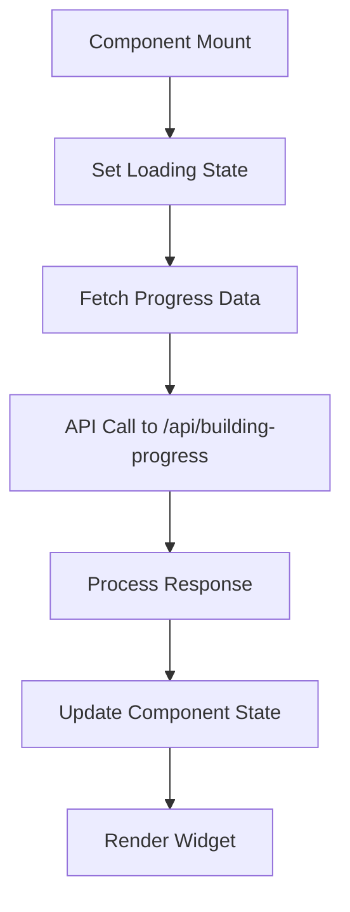
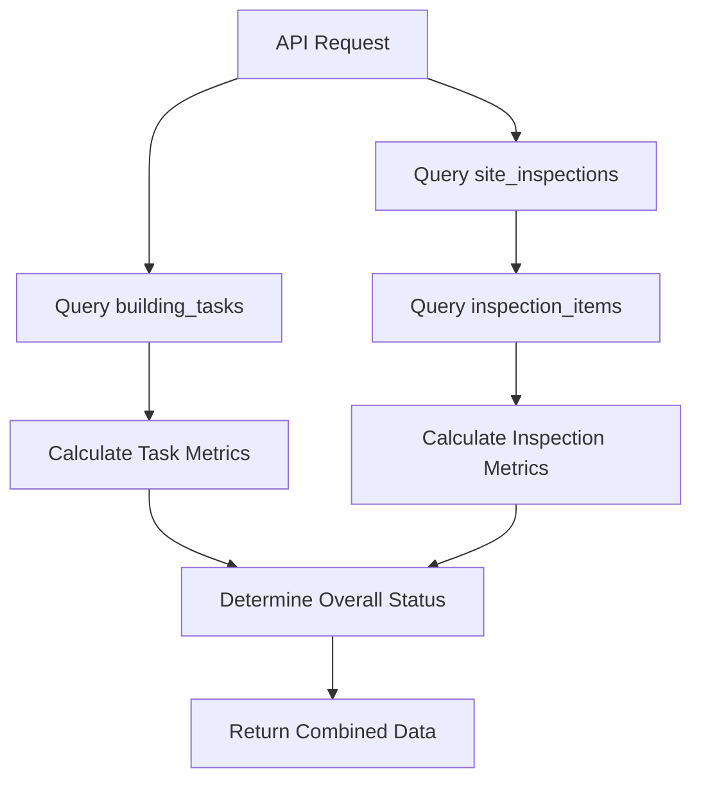
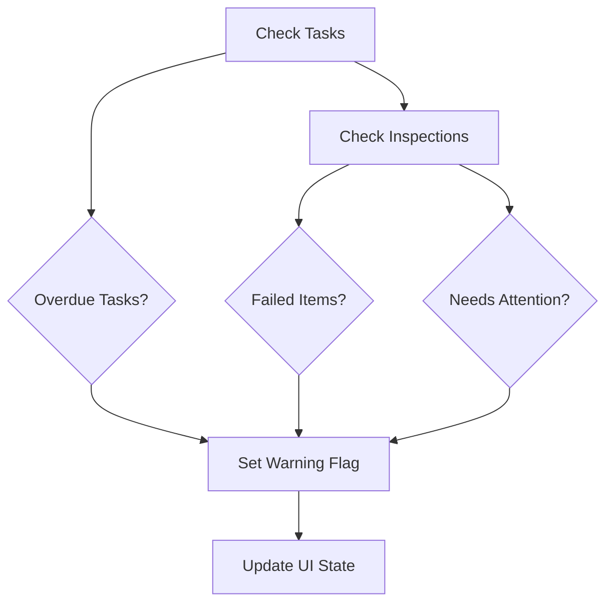

# Progress Tracker Widget

## Overview

The Progress Tracker Widget is a comprehensive dashboard component for BlocIQ that provides property managers with a quick overview of building progress, including task completion rates and inspection status. It features visual progress indicators, warning systems, and quick access to detailed views.

## 🎯 Features

### Core Functionality
- **Task Progress Tracking**: Shows completion percentage and remaining tasks
- **Inspection Status**: Displays latest inspection results and asset compliance
- **Warning System**: Highlights overdue tasks and failed inspection items
- **Real-time Updates**: Refresh button for live data synchronization
- **Quick Actions**: Direct links to detailed task and inspection views

### Visual Indicators
- **Progress Bars**: Color-coded progress indicators (green for good, yellow for moderate, red for issues)
- **Status Badges**: Warning badges for overdue tasks and failed inspections
- **Icons**: Intuitive icons for different status types
- **Color Coding**: Consistent color scheme matching BlocIQ branding

## 🏗️ Technical Implementation

### Backend API

#### Endpoint: `GET /api/building-progress/[buildingId]`

**Purpose**: Fetches comprehensive progress data for a building

**Response Structure**:
```typescript
{
  success: boolean;
  data: {
    tasks: {
      total: number;
      completed: number;
      overdue: number;
      percentage: number;
    };
    inspection: {
      totalItems: number;
      okItems: number;
      failedItems: number;
      needsAttentionItems: number;
      percentage: number;
      lastInspectionDate: string | null;
      lastInspectionStatus: string | null;
    };
    overall: {
      status: 'good' | 'warning';
      hasWarnings: boolean;
    };
  };
}
```

**Data Sources**:
- `building_tasks` table for task statistics
- `site_inspections` table for inspection metadata
- `inspection_items` table for detailed inspection results

**Calculations**:
- Task completion percentage: `(completed / total) * 100`
- Inspection success rate: `(okItems / totalItems) * 100`
- Overdue task detection: Tasks with due dates in the past and status not "Complete"
- Warning detection: Overdue tasks OR failed inspection items OR items needing attention

### Frontend Component

#### ProgressTrackerWidget Component

**Props Interface**:
```typescript
interface ProgressTrackerWidgetProps {
  buildingId: string;                    // Required: Building identifier
  className?: string;                    // Optional: Additional CSS classes
  showRefreshButton?: boolean;           // Optional: Show/hide refresh button (default: true)
  onRefresh?: () => void;                // Optional: Refresh callback function
}
```

**Key Features**:
- **Responsive Design**: Adapts to different screen sizes
- **Loading States**: Skeleton loaders during data fetching
- **Error Handling**: Graceful error display with retry options
- **Auto-refresh**: Automatic data fetching on component mount
- **Manual Refresh**: User-triggered data updates

## 🎨 User Interface

### Widget Layout

#### Header Section
- **Title**: "Progress Tracker" with trending up icon
- **Warning Badge**: Red warning badge when issues detected
- **Refresh Button**: Optional refresh button with loading state

#### Task Progress Section
- **Icon**: CheckCircle icon in blue
- **Progress Bar**: Visual progress indicator with percentage
- **Statistics**: "X of Y complete" format
- **Overdue Warning**: Red badge showing number of overdue tasks
- **Remaining Count**: Shows tasks still to be completed

#### Inspection Progress Section
- **Icon**: FileText icon in green
- **Progress Bar**: Visual progress indicator with percentage
- **Statistics**: "X of Y OK" format
- **Issue Warning**: Red badge showing number of failed items
- **Last Inspection Info**: Date and status of most recent inspection

#### Warning Section (Conditional)
- **Icon**: AlertTriangle icon in red
- **Overdue Tasks**: List of overdue task counts
- **Failed Inspections**: List of failed inspection items
- **Needs Attention**: Items requiring follow-up

#### Quick Actions Section
- **View Tasks Button**: Links to building tasks tab
- **View Inspections Button**: Links to building inspections tab

### Visual States

#### Good Progress State
- **Background**: Standard white background
- **Progress Bars**: Green for high completion rates
- **No Warning Badges**: Clean interface
- **Border**: Standard gray border

#### Warning State
- **Background**: Light red background tint
- **Progress Bars**: Red for low completion rates or issues
- **Warning Badges**: Red badges for overdue tasks and failed items
- **Border**: Red border to highlight issues

### Responsive Behavior

#### Desktop (lg+)
- **Layout**: Full-width widget with all features
- **Spacing**: Generous spacing between sections
- **Actions**: Side-by-side quick action buttons

#### Tablet (md)
- **Layout**: Maintains full functionality
- **Spacing**: Moderate spacing adjustments
- **Actions**: Stacked quick action buttons

#### Mobile (sm)
- **Layout**: Compact layout with essential information
- **Spacing**: Tight spacing for mobile screens
- **Actions**: Full-width action buttons
- **Text**: Smaller font sizes for mobile readability

## 🔧 Integration Examples

### Basic Integration
```tsx
import ProgressTrackerWidget from "@/components/ProgressTrackerWidget";

function BuildingDashboard({ buildingId }) {
  return (
    <div className="p-6">
      <ProgressTrackerWidget buildingId={buildingId} />
    </div>
  );
}
```

### Custom Styling
```tsx
<ProgressTrackerWidget 
  buildingId="building-123"
  className="max-w-md mx-auto"
  showRefreshButton={false}
/>
```

### With Refresh Callback
```tsx
<ProgressTrackerWidget 
  buildingId="building-123"
  onRefresh={() => {
    // Update parent component state
    setLastRefresh(new Date());
    // Show notification
    toast.success('Progress data updated');
  }}
/>
```

### Dashboard Integration
```tsx
function DashboardPage() {
  return (
    <div className="grid grid-cols-1 md:grid-cols-2 lg:grid-cols-3 gap-6">
      {buildings.map(building => (
        <Card key={building.id}>
          <CardHeader>
            <CardTitle>{building.name}</CardTitle>
          </CardHeader>
          <CardContent>
            <ProgressTrackerWidget 
              buildingId={building.id}
              showRefreshButton={false}
              className="w-full"
            />
          </CardContent>
        </Card>
      ))}
    </div>
  );
}
```

## 📊 Data Flow

### 1. Component Initialization


### 2. Data Fetching Process


### 3. Warning Detection Logic


## 🎯 Use Cases

### Property Manager Dashboard
- **Overview**: Quick status check across multiple buildings
- **Prioritization**: Identify buildings needing immediate attention
- **Progress Tracking**: Monitor task completion across portfolio

### Building Detail Page
- **Context**: Building-specific progress overview
- **Navigation**: Quick access to detailed task and inspection views
- **Status**: Real-time building health indicator

### Compliance Monitoring
- **Inspection Tracking**: Monitor inspection completion rates
- **Issue Detection**: Identify failed compliance items
- **Timeline**: Track last inspection dates

### Task Management
- **Completion Tracking**: Monitor task progress
- **Overdue Alerts**: Identify delayed tasks
- **Resource Allocation**: Understand workload distribution

## 🔒 Security Considerations

### Data Access
- **Row Level Security**: Users can only access data for their buildings
- **API Validation**: Building ID validation on all requests
- **Error Handling**: Secure error messages without data leakage

### Performance
- **Database Indexes**: Optimized queries for fast data retrieval
- **Caching**: Efficient data fetching and state management
- **Lazy Loading**: Components load only when needed

## 🚀 Performance Optimizations

### Database Queries
```sql
-- Optimized task query with filtering
SELECT id, status, due_date 
FROM building_tasks 
WHERE building_id = $1;

-- Optimized inspection query with joins
SELECT si.id, si.inspection_date, si.status, 
       COUNT(ii.id) as total_items,
       COUNT(CASE WHEN ii.status = 'OK' THEN 1 END) as ok_items
FROM site_inspections si
LEFT JOIN inspection_items ii ON si.id = ii.inspection_id
WHERE si.building_id = $1
GROUP BY si.id, si.inspection_date, si.status
ORDER BY si.inspection_date DESC
LIMIT 1;
```

### Frontend Optimizations
- **Debounced Refresh**: Prevents excessive API calls
- **Memoization**: Efficient re-rendering with React.memo
- **State Management**: Optimized state updates
- **Loading States**: Better perceived performance

## 📱 Mobile Experience

### Touch-Friendly Design
- **Large Touch Targets**: Minimum 44px touch areas
- **Swipe Gestures**: Support for refresh gestures
- **Responsive Typography**: Readable text at all sizes

### Performance on Mobile
- **Optimized Images**: Efficient icon loading
- **Reduced Animations**: Smooth but not resource-intensive
- **Efficient Rendering**: Optimized for mobile devices

## 🔮 Future Enhancements

### Planned Features
1. **Real-time Updates**: WebSocket integration for live updates
2. **Custom Thresholds**: Configurable warning thresholds
3. **Historical Data**: Progress trends over time
4. **Export Functionality**: PDF/Excel progress reports
5. **Notification Integration**: Push notifications for warnings
6. **Advanced Filtering**: Filter by task type or inspection category

### AI Enhancements
1. **Predictive Analytics**: Forecast completion dates
2. **Smart Recommendations**: AI-powered task prioritization
3. **Anomaly Detection**: Identify unusual patterns
4. **Automated Alerts**: Smart notification system

## 📋 Testing Strategy

### Unit Tests
- **Component Rendering**: Test different prop combinations
- **State Management**: Test loading, error, and success states
- **User Interactions**: Test refresh button and quick actions

### Integration Tests
- **API Integration**: Test data fetching and error handling
- **Database Queries**: Test performance and accuracy
- **Security**: Test RLS policies and access control

### E2E Tests
- **User Workflows**: Test complete user journeys
- **Responsive Design**: Test across different screen sizes
- **Performance**: Test loading times and responsiveness

## 🎉 Benefits

### For Property Managers
1. **Quick Overview**: Instant building status assessment
2. **Proactive Management**: Early warning system for issues
3. **Efficient Navigation**: Quick access to detailed views
4. **Progress Tracking**: Visual progress indicators
5. **Compliance Monitoring**: Automated compliance tracking

### For Building Operations
1. **Resource Optimization**: Better task prioritization
2. **Risk Reduction**: Early issue identification
3. **Standardized Monitoring**: Consistent progress tracking
4. **Professional Reporting**: Clean, professional interface
5. **Mobile Accessibility**: On-the-go monitoring

### For Business
1. **Operational Efficiency**: Streamlined monitoring processes
2. **Client Satisfaction**: Professional progress reporting
3. **Compliance Assurance**: Automated compliance tracking
4. **Scalability**: Easy to manage multiple buildings
5. **Data Insights**: Valuable operational metrics

The Progress Tracker Widget provides a comprehensive, user-friendly solution for monitoring building progress and maintaining operational excellence in property management. 