# BlocIQ Platform Architecture - Professional Flow Diagram

## Executive Summary
BlocIQ is a comprehensive property management platform designed for UK leasehold properties, built with GDPR compliance and data security as core principles.

## System Architecture Flow

```mermaid
flowchart TD
    %% User Interface Layer
    subgraph "👥 BlocIQ User Interface Layer"
        A[Property Manager<br/>🏢 Building Management<br/>Portfolio Oversight]
        B[Leaseholder<br/>🏠 Tenant Portal<br/>Digital Access]
        C[Investor<br/>📊 Portfolio View<br/>Analytics Dashboard]
    end
    
    %% Application Layer
    subgraph "📱 BlocIQ Application Layer"
        D[Next.js Frontend<br/>React Components<br/>TypeScript<br/>Responsive UI]
        E[API Routes<br/>Server Actions<br/>Authentication<br/>Middleware]
    end
    
    %% Core Services
    subgraph "🔧 BlocIQ Core Services"
        F[🗄️ Supabase Backend<br/>PostgreSQL Database<br/>Real-time Subscriptions<br/>File Storage<br/>Authentication]
        G[📧 Microsoft Graph API<br/>Outlook Integration<br/>Calendar Management<br/>Email Processing<br/>OAuth 2.0]
        H[🤖 OpenAI GPT-4<br/>Document Analysis<br/>AI Drafting<br/>Content Generation<br/>GDPR-Safe Processing]
        I[📄 Google Document AI<br/>OCR Processing<br/>Text Extraction<br/>EU Endpoints<br/>Lease Analysis]
        J[📬 SendGrid<br/>Email Delivery<br/>SMTP Services<br/>Template Management<br/>GDPR Compliant]
    end
    
    %% Data Layer
    subgraph "📊 BlocIQ Data Model"
        K[🏢 Buildings<br/>Property Information<br/>Management Data<br/>Location Details]
        L[🏠 Units<br/>Individual Properties<br/>Lease Details<br/>Tenant Information]
        M[👥 Leaseholders<br/>Tenant Data<br/>Contact Information<br/>Communication History]
        N[💬 Communications<br/>Email History<br/>Message Threads<br/>Document Attachments]
        O[📋 Compliance<br/>Safety Documents<br/>Certificates<br/>Regulatory Records]
        P[📄 Leases<br/>Legal Documents<br/>Terms & Conditions<br/>Renewal Tracking]
    end
    
    %% Security & Compliance
    subgraph "🛡️ BlocIQ Security & Compliance"
        Q[🔒 GDPR Compliance<br/>• EU/UK Data Residency<br/>• Right to be Forgotten<br/>• Data Minimization<br/>• Consent Management<br/>• Privacy by Design]
        R[🔐 Row Level Security<br/>• Agency Data Isolation<br/>• User Permission Matrix<br/>• Audit Logging<br/>• Access Controls]
        S[🔑 OAuth 2.0 Security<br/>• Microsoft Integration<br/>• Secure Token Exchange<br/>• Multi-Factor Auth<br/>• Session Management]
    end
    
    %% Connections
    A --> D
    B --> D
    C --> D
    
    D --> E
    E --> F
    E --> G
    E --> H
    E --> I
    E --> J
    
    F --> K
    F --> L
    F --> M
    F --> N
    F --> O
    F --> P
    
    F -.-> Q
    F -.-> R
    G -.-> S
    
    %% BlocIQ Brand Styling
    classDef userClass fill:#e3f2fd,stroke:#1976d2,stroke-width:3px,color:#000,font-weight:bold,font-family:'Segoe UI',Arial
    classDef appClass fill:#f3e5f5,stroke:#7b1fa2,stroke-width:3px,color:#000,font-weight:bold,font-family:'Segoe UI',Arial
    classDef serviceClass fill:#e8f5e8,stroke:#388e3c,stroke-width:2px,color:#000,font-family:'Segoe UI',Arial
    classDef dataClass fill:#fff3e0,stroke:#f57c00,stroke-width:2px,color:#000,font-family:'Segoe UI',Arial
    classDef securityClass fill:#ffebee,stroke:#d32f2f,stroke-width:3px,color:#000,font-weight:bold,font-family:'Segoe UI',Arial
    
    class A,B,C userClass
    class D,E appClass
    class F,G,H,I,J serviceClass
    class K,L,M,N,O,P dataClass
    class Q,R,S securityClass
```

## Technical Specifications

### 🏗️ **Platform Stack**
- **Frontend**: Next.js 14, React 18, TypeScript
- **Backend**: Supabase (PostgreSQL, Auth, Storage)
- **AI Services**: OpenAI GPT-4, Google Document AI
- **Communication**: Microsoft Graph, SendGrid
- **Hosting**: Vercel (EU region), Supabase (EU region)

### 🔒 **Security Features**
- **Data Encryption**: AES-256 encryption at rest and in transit
- **Authentication**: OAuth 2.0 with Microsoft Azure AD
- **Authorization**: Row Level Security (RLS) for data isolation
- **Compliance**: GDPR, UK Data Protection Act 2018
- **Audit**: Comprehensive logging and monitoring

### 📈 **Business Benefits**
- **Efficiency**: Automated document processing and communication
- **Compliance**: Built-in regulatory compliance tracking
- **Transparency**: Real-time access to property information
- **Scalability**: Cloud-native architecture for growth
- **Cost-Effective**: Reduced manual processes and administrative overhead

### 🎯 **Target Markets**
- **Property Management Companies**: Multi-building portfolio management
- **Leasehold Properties**: Individual building management
- **Real Estate Investors**: Portfolio oversight and compliance
- **Managing Agents**: Streamlined tenant communication

---

## 🎨 **BlocIQ Brand Kit Integration**

### **Brand Colors & Visual Identity**
- **Primary Blue**: `#1976d2` - User Interface Layer
- **Secondary Purple**: `#7b1fa2` - Application Layer  
- **Success Green**: `#388e3c` - Core Services
- **Warning Orange**: `#f57c00` - Data Model
- **Error Red**: `#d32f2f` - Security & Compliance

### **Typography System**
- **Font Family**: Segoe UI, Arial (Professional, readable)
- **Font Weights**: Bold for headers, Regular for content
- **Visual Hierarchy**: Clear distinction between system layers

### **Icon System**
- 👥 **User Interface**: Property Managers, Leaseholders, Investors
- 📱 **Application**: Next.js, React, TypeScript
- 🗄️ **Database**: Supabase, PostgreSQL, Real-time
- 📧 **Communication**: Microsoft Graph, Outlook
- 🤖 **AI Services**: OpenAI GPT-4, Document Analysis
- 📄 **OCR Processing**: Google Document AI, Text Extraction
- 📬 **Email Delivery**: SendGrid, SMTP Services
- 🏢 **Buildings**: Property Information, Management
- 🏠 **Units**: Individual Properties, Lease Details
- 👥 **Leaseholders**: Tenant Data, Contact Information
- 💬 **Communications**: Email History, Message Threads
- 📋 **Compliance**: Safety Documents, Certificates
- 📄 **Leases**: Legal Documents, Terms & Conditions
- 🔒 **GDPR**: Data Residency, Privacy Controls
- 🔐 **Security**: Row Level Security, Access Controls
- 🔑 **Authentication**: OAuth 2.0, Multi-Factor Auth

### **Brand Messaging Framework**
- **Trust & Security**: GDPR-compliant, EU data residency
- **Innovation**: AI-powered automation and analysis
- **Efficiency**: Streamlined workflows and processes
- **Transparency**: Clear data handling and user access
- **Professional**: Enterprise-grade security and compliance

### **Visual Design Principles**
- **Clean Layout**: Modern, uncluttered interface design
- **Color Consistency**: Brand colors applied systematically
- **Icon Clarity**: Meaningful, recognizable icons throughout
- **Typography Hierarchy**: Clear information architecture
- **Professional Aesthetic**: Suitable for investor presentations

---

*This architecture ensures BlocIQ delivers a secure, compliant, and efficient property management solution for the UK market with comprehensive brand kit integration.*
