# BlocIQ Platform Architecture Flow Diagram

## Professional Flow Diagram for Investors & Property Managers

```mermaid
graph TD
    %% User Layer
    A[👤 Property Manager<br/>🏢 Leaseholder] --> B[📱 BlocIQ Platform<br/>Next.js Application<br/>UK-Based Interface<br/>Property Management Hub]
    
    %% Main Platform
    B --> C[🗄️ Supabase Database<br/>PostgreSQL & File Storage<br/>EU/UK Region Hosted<br/>Real-time Sync]
    B --> D[📧 Microsoft Outlook/Graph<br/>Email & Calendar Integration<br/>Secure OAuth 2.0<br/>Communication Hub]
    B --> E[🤖 OpenAI GPT-4<br/>AI Document Analysis<br/>GDPR-Safe Processing<br/>Intelligent Drafting]
    B --> F[📄 Google Document AI<br/>OCR Text Extraction<br/>EU Endpoint Processing<br/>Lease Analysis]
    B --> G[📬 SendGrid/SMTP<br/>Email Delivery Service<br/>GDPR Compliant<br/>Template Management]
    
    %% Data Model
    C --> H[📊 BlocIQ Data Model]
    H --> I[🏢 Buildings<br/>Property Information<br/>Management Data]
    H --> J[🏠 Units<br/>Individual Properties<br/>Lease Details]
    H --> K[👥 Leaseholders<br/>Tenant Information<br/>Contact Details]
    H --> L[💬 Communications<br/>Email History<br/>Message Threads]
    H --> M[📋 Compliance Documents<br/>Safety Certificates<br/>Regulatory Records]
    
    %% Security & Compliance Box
    N[🛡️ BlocIQ Security & GDPR Compliance<br/>• Data hosted in EU/UK regions<br/>• GDPR-aligned retention & access controls<br/>• Leaseholder & building data ring-fenced per agency<br/>• Secure Outlook OAuth & Supabase RLS<br/>• AES-256 encryption at rest and in transit]
    
    %% Styling with BlocIQ Brand Colors
    classDef userClass fill:#e3f2fd,stroke:#1976d2,stroke-width:3px,color:#000,font-weight:bold,font-family:Arial
    classDef platformClass fill:#f3e5f5,stroke:#7b1fa2,stroke-width:3px,color:#000,font-weight:bold,font-family:Arial
    classDef serviceClass fill:#e8f5e8,stroke:#388e3c,stroke-width:2px,color:#000,font-family:Arial
    classDef dataClass fill:#fff3e0,stroke:#f57c00,stroke-width:2px,color:#000,font-family:Arial
    classDef securityClass fill:#ffebee,stroke:#d32f2f,stroke-width:3px,color:#000,font-weight:bold,font-family:Arial
    
    class A userClass
    class B platformClass
    class C,D,E,F,G serviceClass
    class H,I,J,K,L,M dataClass
    class N securityClass
```

## Key Features Highlighted

### 🔒 **GDPR Compliance & Security**
- **Data Residency**: All data hosted in EU/UK regions
- **Access Controls**: Row Level Security (RLS) ensures data isolation per agency
- **Data Retention**: GDPR-aligned policies for data lifecycle management
- **Secure Authentication**: OAuth integration with Microsoft Outlook

### 🏗️ **Platform Architecture**
- **Frontend**: Next.js React application with modern UI/UX
- **Backend**: Supabase provides database, authentication, and file storage
- **AI Integration**: OpenAI for intelligent document analysis and drafting
- **OCR Processing**: Google Document AI for lease document text extraction
- **Communication**: Integrated email delivery through SendGrid

### 📊 **Data Model**
- **Buildings**: Property management and building information
- **Units**: Individual property units and their details
- **Leaseholders**: Tenant information and lease agreements
- **Communications**: Email and communication history
- **Compliance Documents**: Safety certificates and regulatory documents

### 🎯 **Target Audience**
- **Property Managers**: Streamlined building and tenant management
- **Leaseholders**: Direct access to property information and communications
- **Investors**: Transparent, compliant property management platform

---

## 🎨 **BlocIQ Brand Kit Integration**

### **Brand Colors**
- **Primary Blue**: `#1976d2` (User Interface)
- **Secondary Purple**: `#7b1fa2` (Platform Core)
- **Success Green**: `#388e3c` (Services)
- **Warning Orange**: `#f57c00` (Data Layer)
- **Error Red**: `#d32f2f` (Security)

### **Typography**
- **Primary Font**: Segoe UI, Arial
- **Weight**: Bold for headers, Regular for content
- **Hierarchy**: Clear visual distinction between layers

### **Icons & Visual Elements**
- 👤 **Users**: Property Managers, Leaseholders
- 📱 **Platform**: Mobile-first, responsive design
- 🗄️ **Database**: Secure data storage
- 📧 **Communication**: Email integration
- 🤖 **AI**: Intelligent automation
- 📄 **Documents**: OCR and processing
- 📬 **Delivery**: Email services
- 🛡️ **Security**: GDPR compliance
- 🏢 **Buildings**: Property management
- 🏠 **Units**: Individual properties
- 👥 **People**: Leaseholders and tenants
- 💬 **Messages**: Communication history
- 📋 **Compliance**: Regulatory documents

### **Brand Messaging**
- **Trust**: GDPR-compliant, secure platform
- **Innovation**: AI-powered automation
- **Efficiency**: Streamlined property management
- **Transparency**: Clear data handling and access

---

*This diagram represents BlocIQ's secure, GDPR-compliant property management platform designed for the UK market with full brand kit integration.*
