# BlocIQ - Property Management Platform
## Investor & Property Manager Overview

### 🏢 **Platform Overview**
BlocIQ is a comprehensive property management platform designed specifically for UK leasehold properties, combining AI-powered automation with GDPR-compliant data security.

---

## System Flow Diagram

```mermaid
graph LR
    %% User Layer
    subgraph "👥 BlocIQ Users"
        A[Property Managers<br/>🏢 Portfolio Management<br/>Building Oversight]
        B[Leaseholders<br/>🏠 Tenant Portal<br/>Digital Access]
        C[Investors<br/>📊 Analytics Dashboard<br/>ROI Tracking]
    end
    
    %% Main Platform
    subgraph "📱 BlocIQ Platform"
        D[Web Application<br/>📋 Document Management<br/>💬 Communication Hub<br/>📊 Compliance Tracking<br/>🤖 AI-Powered Automation]
    end
    
    %% External Services
    subgraph "🔧 BlocIQ Integrated Services"
        E[🗄️ Supabase Database<br/>EU Hosted<br/>Secure Storage<br/>Real-time Sync]
        F[📧 Microsoft Outlook<br/>Email Integration<br/>Calendar Sync<br/>OAuth 2.0]
        G[🤖 OpenAI GPT-4<br/>Document Analysis<br/>Content Generation<br/>GDPR-Safe Processing]
        H[📄 Google Document AI<br/>OCR Text Extraction<br/>EU Processing<br/>Lease Analysis]
        I[📬 SendGrid Email<br/>Delivery Service<br/>SMTP Services<br/>GDPR Compliant]
    end
    
    %% Data Security
    subgraph "🛡️ BlocIQ Security & Compliance"
        J[🔒 GDPR Compliant<br/>• EU Data Residency<br/>• Agency Data Isolation<br/>• Secure Authentication<br/>• Audit Logging<br/>• AES-256 Encryption]
    end
    
    %% Connections
    A --> D
    B --> D
    C --> D
    
    D --> E
    D --> F
    D --> G
    D --> H
    D --> I
    
    E -.-> J
    F -.-> J
    G -.-> J
    H -.-> J
    I -.-> J
    
    %% BlocIQ Brand Styling
    classDef userClass fill:#e3f2fd,stroke:#1976d2,stroke-width:3px,color:#000,font-weight:bold,font-family:'Segoe UI',Arial
    classDef platformClass fill:#f3e5f5,stroke:#7b1fa2,stroke-width:3px,color:#000,font-weight:bold,font-family:'Segoe UI',Arial
    classDef serviceClass fill:#e8f5e8,stroke:#388e3c,stroke-width:2px,color:#000,font-family:'Segoe UI',Arial
    classDef securityClass fill:#ffebee,stroke:#d32f2f,stroke-width:3px,color:#000,font-weight:bold,font-family:'Segoe UI',Arial
    
    class A,B,C userClass
    class D platformClass
    class E,F,G,H,I serviceClass
    class J securityClass
```

---

## Key Value Propositions

### 🎯 **For Property Managers**
- **Automated Document Processing**: AI-powered lease analysis and compliance tracking
- **Streamlined Communication**: Integrated email and tenant management
- **Regulatory Compliance**: Built-in safety certificate and inspection tracking
- **Cost Reduction**: Eliminate manual processes and administrative overhead

### 🏠 **For Leaseholders**
- **Transparent Access**: Real-time view of property information and communications
- **Digital Portal**: Easy access to lease documents and building updates
- **Direct Communication**: Seamless communication with property management

### 📊 **For Investors**
- **Portfolio Oversight**: Comprehensive view of all properties and compliance status
- **Risk Management**: Automated compliance monitoring and alerting
- **Performance Analytics**: Data-driven insights into property management efficiency
- **Regulatory Assurance**: GDPR-compliant data handling and reporting

---

## Technical Highlights

### 🔒 **Security & Compliance**
- **Data Residency**: All data hosted in EU/UK regions
- **GDPR Compliance**: Full compliance with UK Data Protection Act 2018
- **Agency Isolation**: Row Level Security ensures data separation per agency
- **Secure Authentication**: OAuth 2.0 integration with Microsoft Azure AD

### 🚀 **Technology Stack**
- **Frontend**: Modern React/Next.js application
- **Backend**: Supabase (PostgreSQL) with real-time capabilities
- **AI Integration**: OpenAI GPT-4 for intelligent document processing
- **OCR Processing**: Google Document AI for text extraction
- **Communication**: Microsoft Graph API for email integration

### 📈 **Scalability & Performance**
- **Cloud-Native**: Built for scalability and high availability
- **Real-Time Updates**: Live data synchronization across all users
- **API-First**: Extensible architecture for future integrations
- **Mobile Responsive**: Optimized for all devices and screen sizes

---

## Market Opportunity

### 🏢 **UK Property Management Market**
- **Market Size**: £2.5bn+ property management services market
- **Digital Transformation**: Increasing demand for technology solutions
- **Regulatory Pressure**: Growing compliance requirements driving automation
- **Cost Efficiency**: Need for operational efficiency and cost reduction

### 🎯 **Target Segments**
- **Property Management Companies**: 500+ buildings under management
- **Leasehold Properties**: Individual building management
- **Real Estate Investors**: Portfolio management and oversight
- **Managing Agents**: Streamlined tenant and building services

---

## 🎨 **BlocIQ Brand Kit Integration**

### **Brand Color Palette**
- **Primary Blue**: `#1976d2` - User Interface (Trust, Professional)
- **Secondary Purple**: `#7b1fa2` - Platform Core (Innovation, Premium)
- **Success Green**: `#388e3c` - Services (Growth, Efficiency)
- **Warning Orange**: `#f57c00` - Data Layer (Information, Value)
- **Error Red**: `#d32f2f` - Security (Protection, Compliance)

### **Typography & Visual Identity**
- **Font Family**: Segoe UI, Arial (Professional, accessible)
- **Font Weights**: Bold for emphasis, Regular for readability
- **Visual Hierarchy**: Clear information architecture

### **Comprehensive Icon System**
- 👥 **Users**: Property Managers, Leaseholders, Investors
- 📱 **Platform**: Web Application, Mobile-responsive
- 🗄️ **Database**: Supabase, EU-hosted, Secure
- 📧 **Communication**: Microsoft Outlook, Email Integration
- 🤖 **AI**: OpenAI GPT-4, Document Analysis, Automation
- 📄 **OCR**: Google Document AI, Text Extraction, Processing
- 📬 **Delivery**: SendGrid, Email Services, SMTP
- 🛡️ **Security**: GDPR Compliance, Data Protection
- 🏢 **Buildings**: Property Management, Portfolio Oversight
- 🏠 **Units**: Individual Properties, Tenant Management
- 📊 **Analytics**: ROI Tracking, Performance Metrics
- 💬 **Messages**: Communication History, Threads
- 📋 **Compliance**: Safety Documents, Regulatory Records

### **Brand Messaging Framework**
- **Trust & Security**: GDPR-compliant, EU data residency
- **Innovation**: AI-powered automation and intelligent analysis
- **Efficiency**: Streamlined workflows and cost reduction
- **Transparency**: Clear data handling and user access
- **Professional**: Enterprise-grade security and compliance
- **Value**: ROI-focused, investor-friendly platform

### **Visual Design Standards**
- **Clean Aesthetics**: Modern, uncluttered professional design
- **Color Consistency**: Systematic brand color application
- **Icon Clarity**: Meaningful, recognizable visual elements
- **Typography Hierarchy**: Clear information structure
- **Professional Presentation**: Investor-ready visual standards

### **Brand Application Guidelines**
- **Consistent Branding**: BlocIQ name and visual identity throughout
- **Professional Tone**: Suitable for investor presentations
- **Technical Accuracy**: Precise technical specifications
- **Visual Cohesion**: Unified design language across all elements

---

*BlocIQ represents the future of property management - combining cutting-edge AI technology with robust security and compliance to deliver exceptional value for all stakeholders with comprehensive brand kit integration.*
