# BlocIQ Application Flow Diagram

## Frontend Application Flow + APIs + Integrations

```mermaid
flowchart TD
    %% Frontend Application Pages
    subgraph "Frontend Application"
        Home[🏠 Home Dashboard]
        Documents[📄 Document Library]
        Buildings[🏢 Buildings]
        Compliance[🛡️ Compliance Hub]
        Communications[📨 Communications]
        MajorWorks[🔧 Major Works]
        AskBlocIQ[🤖 Ask BlocIQ]

        %% Sub-pages
        BuildingDetails[🏢 Building Details]
        DocumentUpload[⬆️ Document Upload]
        ComplianceAssets[📋 Compliance Assets]
        EmailDrafts[✉️ Email Drafts]
        ProjectManagement[📊 Project Management]

        %% Special Features
        OutlookAddin[📧 Outlook Add-in]
        LeaseProcessing[📋 Lease Processing]
        CalendarSync[📅 Calendar Sync]
    end

    %% Core API Endpoints
    subgraph "Core APIs"
        direction TB

        %% AI & Assistant APIs
        AskAIAPI["/api/ask-ai<br/>AI Query Processing"]
        AskAIEnhanced["/api/ask-ai-enhanced<br/>Enhanced AI with Context"]
        GenerateDraft["/api/generate-draft<br/>Email Draft Generation"]
        AnalyzeDocument["/api/analyze-document<br/>Document Analysis"]

        %% Document Management APIs
        DocumentUploadAPI["/api/documents/upload-enhanced<br/>Document Upload"]
        DocumentCreate["/api/documents/create<br/>Document Creation"]
        DocumentAnalyze["/api/documents/analyze<br/>Document Processing"]

        %% Building Management APIs
        BuildingInfo["/api/buildings/[id]/info<br/>Building Information"]
        BuildingStructure["/api/buildings/[id]/structure<br/>Building Structure"]
        BuildingTasks["/api/building-tasks<br/>Task Management"]

        %% Compliance APIs
        ComplianceAssetsList["/api/compliance/assets/list<br/>List Compliance Assets"]
        ComplianceUpdate["/api/compliance/[bca_id]/update<br/>Update Compliance"]
        ComplianceReminders["/api/compliance/reminders<br/>Compliance Reminders"]

        %% Communication APIs
        EmailHistory["/api/email-history<br/>Email History"]
        CommunicationsBatch["/api/communications/batch-group<br/>Batch Communications"]

        %% Calendar & Events APIs
        CreateEvent["/api/create-event<br/>Event Creation"]
        SyncCalendar["/api/cron/sync-calendar<br/>Calendar Synchronization"]

        %% Major Works APIs
        MajorWorksLogs["/api/major-works-logs<br/>Project Logging"]
        ProjectDetails["/api/major-works/project/[id]/logs<br/>Project Details"]
    end

    %% Outlook Integration APIs
    subgraph "Outlook Integration"
        direction TB
        OutlookSync["/api/cron/sync-outlook<br/>Email Synchronization"]
        OutlookMessages["/api/outlook/v2/messages/*<br/>Message Management"]
        OutlookDraft["/api/outlook/draft<br/>Draft Management"]
        OutlookEnrich["/api/outlook/enrich<br/>Email Enrichment"]
        AddinChat["/api/addin/chat<br/>Add-in Chat Interface"]
        AddinReply["/api/addin/generate-reply<br/>Reply Generation"]
    end

    %% External Services
    subgraph "External Services"
        direction TB
        OutlookAPI[📧 Microsoft Outlook API<br/>Email & Calendar]
        OpenAI[🧠 OpenAI API<br/>GPT-4 Processing]
        OCRService[👁️ OCR Service<br/>Document Text Extraction]
        SupabaseAuth[🔐 Supabase Auth<br/>Authentication]
        StripeAPI[💳 Stripe API<br/>Payment Processing]
    end

    %% Supabase Database
    subgraph "Supabase Database"
        direction TB
        TablesCore[🗄️ Core Tables<br/>buildings, units, leaseholders]
        TablesCompliance[📋 Compliance Tables<br/>compliance_assets, building_compliance_assets]
        TablesDocuments[📄 Document Tables<br/>building_documents, document_analysis]
        TablesEmail[✉️ Email Tables<br/>incoming_emails, email_history]
        TablesAI[🤖 AI Tables<br/>ai_logs, chat_history]
        TablesCalendar[📅 Calendar Tables<br/>property_events, diary_entries]
        TablesMajorWorks[🔧 Project Tables<br/>major_works, major_works_logs]
    end

    %% Frontend to API Connections
    Home --> AskAIAPI
    Home --> BuildingInfo
    Home --> ComplianceReminders

    Documents --> DocumentUploadAPI
    Documents --> DocumentAnalyze
    Documents --> AskAIEnhanced

    Buildings --> BuildingInfo
    Buildings --> BuildingStructure
    Buildings --> BuildingTasks

    Compliance --> ComplianceAssetsList
    Compliance --> ComplianceUpdate
    Compliance --> ComplianceReminders

    Communications --> EmailHistory
    Communications --> CommunicationsBatch
    Communications --> GenerateDraft

    MajorWorks --> MajorWorksLogs
    MajorWorks --> ProjectDetails
    MajorWorks --> CreateEvent

    AskBlocIQ --> AskAIAPI
    AskBlocIQ --> AskAIEnhanced

    OutlookAddin --> AddinChat
    OutlookAddin --> AddinReply
    OutlookAddin --> OutlookDraft

    LeaseProcessing --> AnalyzeDocument
    LeaseProcessing --> DocumentCreate

    CalendarSync --> SyncCalendar
    CalendarSync --> CreateEvent

    %% API to External Service Connections
    AskAIAPI --> OpenAI
    AskAIEnhanced --> OpenAI
    GenerateDraft --> OpenAI
    AnalyzeDocument --> OpenAI
    AnalyzeDocument --> OCRService

    DocumentUploadAPI --> OCRService
    DocumentAnalyze --> OCRService

    OutlookSync --> OutlookAPI
    OutlookMessages --> OutlookAPI
    OutlookDraft --> OutlookAPI
    OutlookEnrich --> OutlookAPI

    SyncCalendar --> OutlookAPI

    %% API to Database Connections
    AskAIAPI --> TablesAI
    AskAIAPI --> TablesDocuments
    AskAIEnhanced --> TablesAI
    AskAIEnhanced --> TablesDocuments
    AskAIEnhanced --> TablesCore

    DocumentUploadAPI --> TablesDocuments
    DocumentCreate --> TablesDocuments
    DocumentAnalyze --> TablesDocuments

    BuildingInfo --> TablesCore
    BuildingStructure --> TablesCore
    BuildingTasks --> TablesCore

    ComplianceAssetsList --> TablesCompliance
    ComplianceUpdate --> TablesCompliance
    ComplianceReminders --> TablesCompliance

    EmailHistory --> TablesEmail
    CommunicationsBatch --> TablesEmail
    GenerateDraft --> TablesEmail
    GenerateDraft --> TablesAI

    CreateEvent --> TablesCalendar
    SyncCalendar --> TablesCalendar

    MajorWorksLogs --> TablesMajorWorks
    ProjectDetails --> TablesMajorWorks

    OutlookSync --> TablesEmail
    OutlookMessages --> TablesEmail

    AddinChat --> TablesAI
    AddinReply --> TablesAI
    AddinReply --> TablesEmail

    %% Authentication Flow
    SupabaseAuth -.-> Home
    SupabaseAuth -.-> Documents
    SupabaseAuth -.-> Buildings
    SupabaseAuth -.-> Compliance
    SupabaseAuth -.-> Communications
    SupabaseAuth -.-> MajorWorks

    %% Payment Flow
    StripeAPI -.-> OutlookAddin

    %% Styling
    classDef frontend fill:#e1f5fe,stroke:#01579b,stroke-width:2px
    classDef api fill:#f3e5f5,stroke:#4a148c,stroke-width:2px
    classDef external fill:#fff3e0,stroke:#e65100,stroke-width:2px
    classDef database fill:#e8f5e8,stroke:#1b5e20,stroke-width:2px
    classDef outlook fill:#fff9c4,stroke:#f57f17,stroke-width:2px

    class Home,Documents,Buildings,Compliance,Communications,MajorWorks,AskBlocIQ,BuildingDetails,DocumentUpload,ComplianceAssets,EmailDrafts,ProjectManagement,LeaseProcessing,CalendarSync frontend
    class AskAIAPI,AskAIEnhanced,GenerateDraft,AnalyzeDocument,DocumentUploadAPI,DocumentCreate,DocumentAnalyze,BuildingInfo,BuildingStructure,BuildingTasks,ComplianceAssetsList,ComplianceUpdate,ComplianceReminders,EmailHistory,CommunicationsBatch,CreateEvent,SyncCalendar,MajorWorksLogs,ProjectDetails api
    class OutlookSync,OutlookMessages,OutlookDraft,OutlookEnrich,AddinChat,AddinReply,OutlookAddin outlook
    class OutlookAPI,OpenAI,OCRService,SupabaseAuth,StripeAPI external
    class TablesCore,TablesCompliance,TablesDocuments,TablesEmail,TablesAI,TablesCalendar,TablesMajorWorks database
```

## Key Features Overview

### 🏠 **Home Dashboard**
- Central hub showing building overview, compliance status, and recent activity
- **APIs**: `/api/ask-ai`, `/api/buildings/[id]/info`, `/api/compliance/reminders`
- **Integrations**: Supabase Auth, OpenAI for insights

### 📄 **Document Library**
- AI-powered document upload, analysis, and intelligent search
- **APIs**: `/api/documents/upload-enhanced`, `/api/documents/analyze`, `/api/ask-ai-enhanced`
- **Integrations**: OCR Service, OpenAI for document understanding

### 🏢 **Buildings**
- Complete property portfolio management with unit and leaseholder tracking
- **APIs**: `/api/buildings/[id]/*`, `/api/building-tasks`
- **Integrations**: Supabase for comprehensive building data

### 🛡️ **Compliance Hub**
- Automated compliance tracking with intelligent reminders and status monitoring
- **APIs**: `/api/compliance/*` endpoints for asset management and updates
- **Integrations**: AI for compliance document analysis

### 📨 **Communications**
- Template-based communication system with AI-powered email drafting
- **APIs**: `/api/email-history`, `/api/communications/batch-group`, `/api/generate-draft`
- **Integrations**: OpenAI for intelligent email generation

### 🔧 **Major Works**
- Project management with progress tracking and documentation
- **APIs**: `/api/major-works-logs`, `/api/major-works/project/[id]/logs`
- **Integrations**: Calendar sync for project milestones

### 🤖 **Ask BlocIQ**
- Intelligent AI assistant with building and document context awareness
- **APIs**: `/api/ask-ai`, `/api/ask-ai-enhanced` with context injection
- **Integrations**: OpenAI GPT-4, document embeddings, building data

### 📧 **Outlook Integration**
- Seamless email sync with AI-powered response generation
- **APIs**: `/api/outlook/v2/*`, `/api/addin/*`, `/api/cron/sync-outlook`
- **Integrations**: Microsoft Graph API, Outlook Add-in platform

### 📅 **Calendar Sync**
- Bi-directional calendar synchronization with property events
- **APIs**: `/api/cron/sync-calendar`, `/api/create-event`
- **Integrations**: Microsoft Calendar API

### 📋 **Lease Processing**
- AI-powered lease document analysis and data extraction
- **APIs**: `/api/analyze-document`, `/api/documents/create`
- **Integrations**: OCR Service, OpenAI for lease understanding