# BlocIQ Database ERD (Supabase Schema)

## Entity Relationship Diagram

```mermaid
erDiagram
    %% CORE BUILDING MANAGEMENT
    buildings ||--o{ units : "contains"
    buildings ||--o{ building_setup : "has setup"
    buildings ||--o{ building_documents : "stores"
    buildings ||--o{ building_compliance_assets : "tracks compliance"
    buildings ||--o{ major_works : "has projects"
    buildings ||--o{ property_events : "schedules"
    buildings ||--o{ diary_entries : "logs activity"
    buildings ||--o{ communications : "sends messages"
    buildings ||--o{ building_amendments : "tracks changes"

    units ||--o{ leaseholders : "occupied by"
    units ||--o{ leases : "governed by"
    units ||--o{ occupiers : "rented to"
    units ||--o{ building_documents : "relates to"
    units ||--o{ communications : "targets"

    leaseholders ||--o{ building_documents : "owns documents"
    leaseholders ||--o{ communications : "receives messages"

    %% COMPLIANCE MANAGEMENT
    compliance_assets ||--o{ building_compliance_assets : "assigned to buildings"
    compliance_assets ||--o{ compliance_documents : "generates documents"
    compliance_assets ||--o{ compliance_contracts : "has contracts"

    building_compliance_assets ||--o{ compliance_documents : "latest document"

    contractors ||--o{ compliance_contracts : "provides services"

    %% USER MANAGEMENT & AGENCIES
    agencies ||--o{ users : "employs"
    agencies ||--o{ profiles : "manages"
    agencies ||--o{ ai_logs : "tracks usage"

    users ||--o{ profiles : "has profile"
    users ||--o{ buildings : "manages"
    users ||--o{ ai_logs : "queries AI"
    users ||--o{ chat_history : "conversation history"
    users ||--o{ communications : "creates"
    users ||--o{ communication_templates : "designs"
    users ||--o{ diary_entries : "writes"
    users ||--o{ property_events : "schedules"
    users ||--o{ major_works_logs : "logs activity"
    users ||--o{ building_amendments : "makes changes"
    users ||--o{ document_queries : "asks questions"
    users ||--o{ outlook_tokens : "authenticates"

    %% EMAIL & COMMUNICATION
    incoming_emails ||--o{ email_drafts : "generates drafts"
    buildings ||--o{ incoming_emails : "receives emails"
    units ||--o{ incoming_emails : "specific to unit"
    leaseholders ||--o{ incoming_emails : "from leaseholder"

    buildings ||--o{ email_history : "email records"
    units ||--o{ email_history : "unit communications"

    communication_templates ||--o{ communications : "uses template"

    %% DOCUMENT MANAGEMENT
    building_documents ||--o{ document_analysis : "analyzed"
    building_documents ||--o{ document_queries : "questioned"

    %% MAJOR WORKS
    major_works ||--o{ major_works_logs : "activity logs"

    %% Table Definitions
    buildings {
        uuid id PK
        varchar name
        text address
        integer unit_count
        text access_notes
        varchar council_borough
        varchar building_manager_name
        varchar building_manager_email
        varchar building_manager_phone
        varchar emergency_contact_name
        varchar emergency_contact_phone
        varchar building_age
        varchar construction_type
        varchar total_floors
        varchar lift_available
        varchar heating_type
        varchar hot_water_type
        varchar waste_collection_day
        text recycling_info
        varchar building_insurance_provider
        date building_insurance_expiry
        varchar fire_safety_status
        varchar asbestos_status
        varchar energy_rating
        varchar service_charge_frequency
        decimal ground_rent_amount
        varchar ground_rent_frequency
        text notes
        text key_access_notes
        varchar entry_code
        varchar fire_panel_location
        boolean demo_ready
        timestamptz created_at
        timestamptz updated_at
    }

    building_setup {
        uuid id PK
        uuid building_id FK
        varchar structure_type
        text operational_notes
        varchar client_type
        varchar client_name
        varchar client_contact
        varchar client_email
        timestamptz created_at
        timestamptz updated_at
    }

    units {
        uuid id PK
        uuid building_id FK
        varchar unit_number
        varchar type
        varchar floor
        uuid leaseholder_id FK
        timestamptz created_at
        timestamptz updated_at
    }

    leaseholders {
        uuid id PK
        uuid unit_id FK
        varchar name
        varchar email
        varchar phone
        timestamptz created_at
        timestamptz updated_at
    }

    agencies {
        uuid id PK
        varchar name
        text tone
        text policies
        timestamptz created_at
        timestamptz updated_at
    }

    users {
        uuid id PK
        varchar email UK
        varchar full_name
        varchar role
        uuid agency_id FK
        uuid building_id FK
        timestamptz created_at
        timestamptz updated_at
    }

    profiles {
        uuid id PK
        uuid user_id FK
        varchar full_name
        varchar role
        uuid agency_id FK
        uuid building_id FK
        timestamptz created_at
        timestamptz updated_at
    }

    compliance_assets {
        uuid id PK
        varchar category
        varchar name
        text description
        integer frequency_months
        boolean is_required
        timestamptz created_at
        timestamptz updated_at
    }

    building_compliance_assets {
        uuid id PK
        uuid building_id FK
        uuid asset_id FK
        varchar status
        text notes
        date next_due_date
        timestamptz last_updated
        uuid latest_document_id FK
        date last_renewed_date
        timestamptz created_at
        timestamptz updated_at
    }

    compliance_documents {
        uuid id PK
        uuid building_id FK
        uuid compliance_asset_id FK
        text document_url
        varchar title
        text summary
        date extracted_date
        varchar doc_type
        timestamptz created_at
        timestamptz updated_at
    }

    contractors {
        uuid id PK
        varchar name
        varchar email
        varchar phone
        text notes
        timestamptz inserted_at
        timestamptz updated_at
    }

    compliance_contracts {
        uuid id PK
        uuid building_id FK
        uuid compliance_asset_id FK
        uuid contractor_id FK
        date start_date
        date end_date
        text contract_file_url
        timestamptz inserted_at
        timestamptz updated_at
    }

    incoming_emails {
        uuid id PK
        varchar message_id UK
        varchar subject
        varchar from_email
        text body_preview
        timestamptz received_at
        boolean unread
        boolean handled
        boolean pinned
        varchar flag_status
        text_array categories
        uuid building_id FK
        uuid unit_id FK
        uuid leaseholder_id FK
        varchar thread_id
        varchar tag
        varchar unit
        uuid user_id FK
        timestamptz created_at
        timestamptz updated_at
    }

    email_history {
        uuid id PK
        varchar message_id
        varchar subject
        varchar sender_email
        varchar recipient_email
        varchar recipient_name
        timestamptz sent_at
        text body_text
        text body_html
        jsonb attachments
        uuid building_id FK
        uuid unit_id FK
        varchar email_type
        varchar status
        text error_message
        timestamptz created_at
    }

    email_drafts {
        uuid id PK
        uuid email_id FK
        text draft_text
        timestamptz created_at
        timestamptz updated_at
    }

    building_documents {
        uuid id PK
        uuid building_id FK
        uuid unit_id FK
        uuid leaseholder_id FK
        varchar file_name
        text file_url
        varchar type
        timestamptz created_at
        timestamptz updated_at
    }

    document_analysis {
        uuid id PK
        uuid document_id FK
        text extracted_text
        text summary
        timestamptz extracted_at
        timestamptz created_at
    }

    document_queries {
        uuid id PK
        uuid user_id FK
        uuid building_id FK
        uuid document_id FK
        text question
        text answer
        timestamptz created_at
    }

    leases {
        uuid id PK
        uuid building_id FK
        uuid unit_id FK
        varchar doc_type
        text doc_url
        date start_date
        date expiry_date
        boolean is_headlease
        uuid uploaded_by FK
        uuid user_id FK
        timestamptz created_at
        timestamptz updated_at
    }

    occupiers {
        uuid id PK
        uuid unit_id FK
        varchar full_name
        varchar email
        varchar phone
        date start_date
        date end_date
        decimal rent_amount
        varchar rent_frequency
        varchar status
        text notes
        timestamptz created_at
        timestamptz updated_at
    }

    communications {
        uuid id PK
        uuid building_id FK
        uuid unit_id FK
        uuid leaseholder_id FK
        varchar type
        varchar subject
        text content
        uuid created_by FK
        integer template_id FK
        varchar send_method
        uuid_array recipient_ids
        boolean sent
        timestamptz sent_at
        timestamptz created_at
        timestamptz updated_at
    }

    communication_templates {
        serial id PK
        varchar name
        varchar type
        varchar subject
        text content
        jsonb variables
        boolean is_active
        uuid created_by FK
        timestamptz created_at
        timestamptz updated_at
    }

    ai_logs {
        uuid id PK
        uuid user_id FK
        uuid agency_id FK
        text question
        text response
        timestamptz timestamp
        timestamptz created_at
    }

    chat_history {
        uuid id PK
        uuid user_id FK
        uuid building_id FK
        text question
        timestamptz timestamp
        timestamptz created_at
    }

    diary_entries {
        uuid id PK
        uuid building_id FK
        text entry_text
        uuid created_by FK
        timestamptz created_at
    }

    property_events {
        uuid id PK
        uuid building_id FK
        varchar title
        text description
        timestamptz start_time
        timestamptz end_time
        varchar event_type
        varchar category
        varchar outlook_event_id UK
        varchar location
        uuid created_by FK
        timestamptz created_at
        timestamptz updated_at
    }

    major_works {
        uuid id PK
        uuid building_id FK
        varchar project_name
        text description
        date start_date
        date end_date
        decimal budget
        varchar status
        varchar contractor
        varchar project_manager
        timestamptz created_at
        timestamptz updated_at
    }

    major_works_logs {
        uuid id PK
        uuid major_works_id FK
        date log_date
        text activity
        text notes
        uuid created_by FK
        timestamptz created_at
    }

    building_amendments {
        uuid id PK
        uuid building_id FK
        varchar field_name
        text old_value
        text new_value
        varchar change_type
        text change_description
        uuid created_by FK
        timestamptz created_at
    }

    outlook_tokens {
        uuid id PK
        uuid user_id FK
        varchar email
        text access_token
        text refresh_token
        timestamptz expires_at
        timestamptz created_at
        timestamptz updated_at
    }
```

## Database Schema Overview

### 🏢 **Core Building Management**
- **buildings**: Central building registry with comprehensive property details
- **building_setup**: Configuration for building structure and client information
- **units**: Individual property units within buildings
- **leaseholders**: Property owners/leaseholders associated with units
- **occupiers**: Current tenants/occupiers of units

### 🛡️ **Compliance Management**
- **compliance_assets**: Template compliance requirements (Fire Safety, Gas Safety, etc.)
- **building_compliance_assets**: Building-specific compliance tracking with due dates
- **compliance_documents**: Uploaded compliance certificates and documents
- **contractors**: Service providers for compliance work
- **compliance_contracts**: Contracts between buildings and compliance contractors

### 👥 **User Management & Multi-tenancy**
- **agencies**: Property management companies/organizations
- **users**: System users linked to agencies
- **profiles**: Extended user profile information
- **building_amendments**: Audit trail for building data changes

### 📧 **Email & Communication System**
- **incoming_emails**: Outlook-synced emails with building/unit associations
- **email_history**: Sent email records
- **email_drafts**: AI-generated email drafts
- **communications**: Template-based communication campaigns
- **communication_templates**: Reusable email/letter templates

### 📄 **Document Management**
- **building_documents**: File storage with building/unit/leaseholder associations
- **document_analysis**: AI-extracted text and summaries
- **document_queries**: AI Q&A history for documents
- **leases**: Lease document registry with important dates

### 🤖 **AI & Analytics**
- **ai_logs**: Complete AI interaction history
- **chat_history**: Conversation tracking by user/building
- **document_queries**: AI document question/answer pairs

### 📅 **Calendar & Events**
- **property_events**: Building-related events with Outlook sync
- **diary_entries**: Manual building activity logs

### 🔧 **Major Works & Projects**
- **major_works**: Construction/renovation project management
- **major_works_logs**: Daily activity logs for projects

### 🔗 **External Integrations**
- **outlook_tokens**: OAuth tokens for Microsoft Graph API
- **property_events.outlook_event_id**: Links to Outlook calendar events

## Key Relationships

1. **Building-Centric**: Most tables relate to buildings as the central entity
2. **User Agency Model**: Multi-tenant architecture through agencies
3. **Document Context**: Documents can be associated with buildings, units, or leaseholders
4. **Compliance Tracking**: Full lifecycle from assets → assignments → documents → contracts
5. **Communication Flow**: Incoming emails → AI drafts → sent communications
6. **Audit Trail**: Building amendments track all data changes
7. **AI Context**: Logs preserve context for improved future interactions