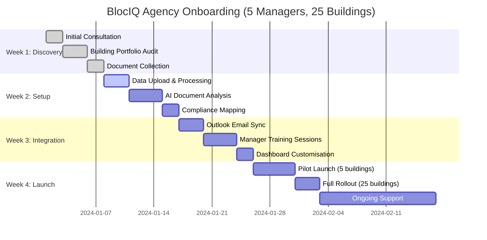

# BlocIQ Marketing Content Vault - Complete

## 📁 Quick Access Guide

This is your complete marketing content vault. All assets are organized and ready for import into Notion, Canva, or any marketing platform.

---

## 🎯 Headlines & Taglines

### Primary Headline
**BlocIQ – Property Management, Reimagined**

### Primary Tagline
**The AI-powered platform that transforms leasehold block management with intelligent automation, GDPR-compliant security, and UK-specific compliance tools.**

### Value Propositions
- **⏱️ Save Time:** Automate 70% of admin tasks with AI-powered document processing and smart inbox management
- **✅ Stay Compliant:** Built-in GDPR compliance, UK legal frameworks (Section 20, BSA, RICS), and automated compliance tracking
- **🇬🇧 Built for UK:** Purpose-built for British leasehold management with UK-specific legal logic and data residency

---

## 📊 Core Diagrams

### How BlocIQ Works
```mermaid
flowchart TD
    %% Data Input Sources
    A[🏢 Buildings & Units] --> DB[🔐 BlocIQ Secure Database<br/>Ring-fenced | GDPR Compliant | UK Hosted]
    B[📄 Lease Documents] --> DB
    C[🛡️ Compliance Certificates] --> DB
    D[📧 Email Communications] --> DB
    E[📊 Financial Records] --> DB
    
    %% AI Processing Layer
    DB --> AI1[🤖 OpenAI GPT-4<br/>Document Analysis & Drafting]
    DB --> AI2[📄 Google Document AI<br/>OCR & Text Extraction]
    DB --> AI3[🔍 Microsoft Graph<br/>Email Intelligence]
    
    %% Output Services
    AI1 --> O1[📬 Smart Inbox<br/>Auto-drafted replies]
    AI1 --> O2[❓ AskBlocIQ<br/>AI assistant]
    AI2 --> O3[📊 Compliance Dashboard<br/>Real-time tracking]
    AI2 --> O4[📈 Automated Reports<br/>Section 20, BSA updates]
    AI3 --> O5[📅 Calendar Sync<br/>Meeting management]
    
    %% Styling
    classDef input fill:#e1f5fe,stroke:#1976d2,stroke-width:2px,color:#000
    classDef database fill:#f3e5f5,stroke:#7b1fa2,stroke-width:3px,color:#000
    classDef ai fill:#fff3e0,stroke:#f57c00,stroke-width:2px,color:#000
    classDef output fill:#e8f5e8,stroke:#388e3c,stroke-width:2px,color:#000
    
    class A,B,C,D,E input
    class DB database
    class AI1,AI2,AI3 ai
    class O1,O2,O3,O4,O5 output
```

### Onboarding Timeline


---

## 🎨 Visual Assets

### Save Time Icon
```svg
<svg width="300" height="200" xmlns="http://www.w3.org/2000/svg">
  <!-- Background with BlocIQ brand gradient -->
  <defs>
    <linearGradient id="bgGradient" x1="0%" y1="0%" x2="100%" y2="100%">
      <stop offset="0%" style="stop-color:#f0fdfa;stop-opacity:1" />
      <stop offset="100%" style="stop-color:#e0f2fe;stop-opacity:1" />
    </linearGradient>
    <linearGradient id="iconGradient" x1="0%" y1="0%" x2="100%" y2="100%">
      <stop offset="0%" style="stop-color:#0d9488;stop-opacity:1" />
      <stop offset="100%" style="stop-color:#2563eb;stop-opacity:1" />
    </linearGradient>
  </defs>
  
  <!-- Background -->
  <rect width="300" height="200" fill="url(#bgGradient)" stroke="#0d9488" stroke-width="3" rx="20"/>
  
  <!-- Clock Icon (Lucide React Clock style) -->
  <circle cx="150" cy="80" r="35" fill="url(#iconGradient)" stroke="#0d9488" stroke-width="3"/>
  <!-- Clock hands -->
  <line x1="150" y1="50" x2="150" y2="80" stroke="white" stroke-width="4" stroke-linecap="round"/>
  <line x1="150" y1="80" x2="170" y2="80" stroke="white" stroke-width="4" stroke-linecap="round"/>
  <!-- Center dot -->
  <circle cx="150" cy="80" r="4" fill="white"/>
  <!-- Clock marks -->
  <circle cx="150" cy="50" r="2" fill="white"/>
  <circle cx="170" cy="80" r="2" fill="white"/>
  <circle cx="150" cy="110" r="2" fill="white"/>
  <circle cx="130" cy="80" r="2" fill="white"/>
  
  <!-- Text with BlocIQ brand colors -->
  <text x="150" y="140" text-anchor="middle" fill="#0d9488" font-family="Inter, sans-serif" font-size="24" font-weight="bold">Save Time</text>
  <text x="150" y="165" text-anchor="middle" fill="#64748b" font-family="Inter, sans-serif" font-size="16">Automate 70% of admin tasks</text>
  <text x="150" y="185" text-anchor="middle" fill="#64748b" font-family="Inter, sans-serif" font-size="16">with intelligent workflows</text>
</svg>
```

### Stay Compliant Icon
```svg
<svg width="300" height="200" xmlns="http://www.w3.org/2000/svg">
  <!-- Background with BlocIQ brand gradient -->
  <defs>
    <linearGradient id="bgGradient" x1="0%" y1="0%" x2="100%" y2="100%">
      <stop offset="0%" style="stop-color:#faf5ff;stop-opacity:1" />
      <stop offset="100%" style="stop-color:#f3e8ff;stop-opacity:1" />
    </linearGradient>
    <linearGradient id="iconGradient" x1="0%" y1="0%" x2="100%" y2="100%">
      <stop offset="0%" style="stop-color:#7c3aed;stop-opacity:1" />
      <stop offset="100%" style="stop-color:#8b5cf6;stop-opacity:1" />
    </linearGradient>
  </defs>
  
  <!-- Background -->
  <rect width="300" height="200" fill="url(#bgGradient)" stroke="#7c3aed" stroke-width="3" rx="20"/>
  
  <!-- Shield Icon (Lucide React Shield style) -->
  <path d="M150 45 L170 55 L170 85 Q170 100 150 105 Q130 100 130 85 L130 55 Z" fill="url(#iconGradient)" stroke="#7c3aed" stroke-width="3"/>
  <!-- Checkmark inside shield -->
  <path d="M140 80 L150 90 L160 75" stroke="white" stroke-width="4" fill="none" stroke-linecap="round" stroke-linejoin="round"/>
  <!-- Shield details -->
  <path d="M150 50 L160 55 L160 75 Q160 85 150 90 Q140 85 140 75 L140 55 Z" fill="rgba(255,255,255,0.2)" stroke="none"/>
  
  <!-- Text with BlocIQ brand colors -->
  <text x="150" y="140" text-anchor="middle" fill="#7c3aed" font-family="Inter, sans-serif" font-size="24" font-weight="bold">Stay Compliant</text>
  <text x="150" y="165" text-anchor="middle" fill="#64748b" font-family="Inter, sans-serif" font-size="16">GDPR & UK regulations</text>
  <text x="150" y="185" text-anchor="middle" fill="#64748b" font-family="Inter, sans-serif" font-size="16">built-in by design</text>
</svg>
```

### Built for UK Icon
```svg
<svg width="300" height="200" xmlns="http://www.w3.org/2000/svg">
  <!-- Background with BlocIQ brand gradient -->
  <defs>
    <linearGradient id="bgGradient" x1="0%" y1="0%" x2="100%" y2="100%">
      <stop offset="0%" style="stop-color:#f0fdfa;stop-opacity:1" />
      <stop offset="100%" style="stop-color:#e0f2fe;stop-opacity:1" />
    </linearGradient>
    <linearGradient id="flagGradient" x1="0%" y1="0%" x2="100%" y2="100%">
      <stop offset="0%" style="stop-color:#0d9488;stop-opacity:1" />
      <stop offset="100%" style="stop-color:#2563eb;stop-opacity:1" />
    </linearGradient>
  </defs>
  
  <!-- Background -->
  <rect width="300" height="200" fill="url(#bgGradient)" stroke="#0d9488" stroke-width="3" rx="20"/>
  
  <!-- UK Flag Icon with BlocIQ styling -->
  <rect x="120" y="60" width="60" height="40" fill="#012169" stroke="#0d9488" stroke-width="2" rx="4"/>
  <!-- White Cross -->
  <rect x="120" y="75" width="60" height="10" fill="white" rx="1"/>
  <rect x="145" y="60" width="10" height="40" fill="white" rx="1"/>
  <!-- Red Cross -->
  <rect x="120" y="77" width="60" height="6" fill="#c8102e" rx="1"/>
  <rect x="147" y="60" width="6" height="40" fill="#c8102e" rx="1"/>
  <!-- Flag pole -->
  <rect x="115" y="55" width="3" height="50" fill="#8b5cf6" rx="1"/>
  
  <!-- UK text overlay -->
  <text x="150" y="85" text-anchor="middle" fill="white" font-family="Inter, sans-serif" font-size="8" font-weight="bold">UK</text>
  
  <!-- Text with BlocIQ brand colors -->
  <text x="150" y="140" text-anchor="middle" fill="#0d9488" font-family="Inter, sans-serif" font-size="24" font-weight="bold">Built for UK</text>
  <text x="150" y="165" text-anchor="middle" fill="#64748b" font-family="Inter, sans-serif" font-size="16">Section 20, BSA, RICS</text>
  <text x="150" y="185" text-anchor="middle" fill="#64748b" font-family="Inter, sans-serif" font-size="16">compliance ready</text>
</svg>
```

---

## 📝 Marketing Copy

### Short Pitch (LinkedIn/Instagram)
> **Transform your property management with BlocIQ** 🏢✨ Our AI-powered platform automates 70% of admin tasks whilst keeping you GDPR-compliant and UK-regulation ready. From smart inbox management to automated Section 20 reports – property management, reimagined. #PropTech #AI #UKProperty

### About BlocIQ (One-Pager)
BlocIQ is the UK's first AI-powered property management platform designed specifically for leasehold block management. We understand the unique challenges faced by property managers, managing agents, and leaseholders in the British market – from complex Section 20 procedures to BSA compliance requirements and RICS standards.

Our platform combines cutting-edge AI technology with deep UK legal expertise, ensuring every feature is built with British property law in mind. Through intelligent document processing, automated compliance tracking, and smart communication tools, BlocIQ reduces administrative burden by 70% whilst maintaining the highest standards of data protection and regulatory compliance.

Built with GDPR by design and hosted entirely within UK/EU data centres, BlocIQ gives you the power of AI without compromising on security or legal compliance. Whether you're managing 5 buildings or 500, our platform scales with your portfolio whilst keeping you ahead of regulatory changes and tenant expectations.

---

## 🎬 Storyboard for Reels

### 5-Frame Storyboard: Problem to Solution

#### Frame 1: The Problem (3 seconds)
```
╔═══════════════════════════════════════════╗
║           😰 OVERWHELMED MANAGER          ║
║                                           ║
║  📊📊📊   📧📧📧   📋📋📋   💸💸💸    ║
║  Spreadsheets  Emails    Forms   Invoices ║
║                                           ║
║        "Too much paperwork!"              ║
╚═══════════════════════════════════════════╝
```

#### Frame 2: BlocIQ Appears (2 seconds)
```
╔═══════════════════════════════════════════╗
║                                           ║
║         🌟 BLOCIQ LOGO APPEARS 🌟         ║
║                                           ║
║     ██████╗ ██╗      ██████╗  ██████╗     ║
║     ██╔══██╗██║     ██╔═══██╗██╔════╝     ║
║     ██║  ██║██║     ██║   ██║██║          ║
║     ██║  ██║██║     ██║   ██║██║          ║
║     ██████╔╝███████╗╚██████╔╝╚██████╗     ║
║     ╚═════╝ ╚══════╝ ╚═════╝  ╚═════╝     ║
║                                           ║
╚═══════════════════════════════════════════╝
```

#### Frame 3: Smart Inbox (3 seconds)
```
╔═══════════════════════════════════════════╗
║           🤖 AI INBOX IN ACTION           ║
║                                           ║
║  ┌─────────────────────────────────────┐  ║
║  │ 📧 New Email: "Heating Issue"      │  ║
║  │ 🤖 AI Draft: "Thank you for your   │  ║
║  │    report. I'll arrange an         │  ║
║  │    engineer visit within 24hrs..."  │  ║
║  │                        [✓ Send]    │  ║
║  └─────────────────────────────────────┘  ║
╚═══════════════════════════════════════════╝
```

#### Frame 4: Compliance Dashboard (3 seconds)
```
╔═══════════════════════════════════════════╗
║        ✅ COMPLIANCE DASHBOARD            ║
║                                           ║
║  📊 Fire Safety    ✅ Up to date         ║
║  🔌 EICR Test      ✅ Valid until 2025   ║
║  🏠 Gas Safety     ✅ Certificate current ║
║  💼 Insurance      ✅ Policy active      ║
║                                           ║
║        "All compliant!" 😊               ║
╚═══════════════════════════════════════════╝
```

#### Frame 5: Call to Action (4 seconds)
```
╔═══════════════════════════════════════════╗
║                                           ║
║       BlocIQ – Property Management,       ║
║              Reimagined                   ║
║                                           ║
║         🚀 Start Your Free Trial         ║
║            www.blociq.co.uk               ║
║                                           ║
║     #PropTech #AI #UKProperty #GDPR       ║
║                                           ║
╚═══════════════════════════════════════════╝
```

---

## 🚀 Export Instructions

### For Notion
1. Copy individual markdown files or this complete vault
2. Paste into Notion pages
3. Mermaid diagrams will render automatically
4. SVG assets can be embedded or saved as images

### For Canva
1. Use SVG assets as design elements
2. Copy text blocks for content
3. Use brand colors: #1976d2, #7b1fa2, #388e3c
4. Apply Inter font family

### For Social Media
1. Use copy blocks for posts and captions
2. Adapt storyboard frames for video content
3. Use hashtag strategy from social media posts
4. Maintain professional, UK-focused tone

### For Presentations
1. Use Mermaid diagrams for slides
2. Apply brand colors and fonts
3. Use value proposition bullets
4. Include compliance and security messaging

---

## 🎨 Brand Guidelines

- **Brand Teal**: #0d9488 (Primary brand color)
- **Brand Blue**: #2563eb (Secondary brand color)  
- **Brand Purple**: #7c3aed (Accent brand color)
- **Success Green**: #10b981
- **Warning Orange**: #f59e0b
- **Error Red**: #ef4444
- **Font**: Inter, system-ui, sans-serif
- **Tone**: Professional, UK-focused, GDPR-compliant
- **Language**: British English spelling
- **Focus**: Leasehold block management, compliance, AI automation
