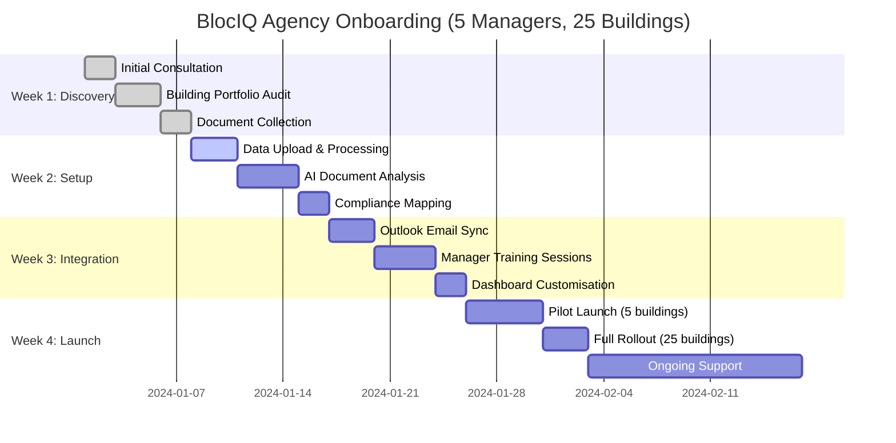

# BlocIQ Onboarding Timeline

## Key Milestones
- **Week 1**: Data discovery and collection
- **Week 2**: AI processing and analysis
- **Week 3**: Integration and training
- **Week 4**: Launch and support

## Usage Notes
- Shows realistic 4-week onboarding timeline
- Perfect for client presentations
- Demonstrates structured approach
- Can be adapted for different agency sizes
